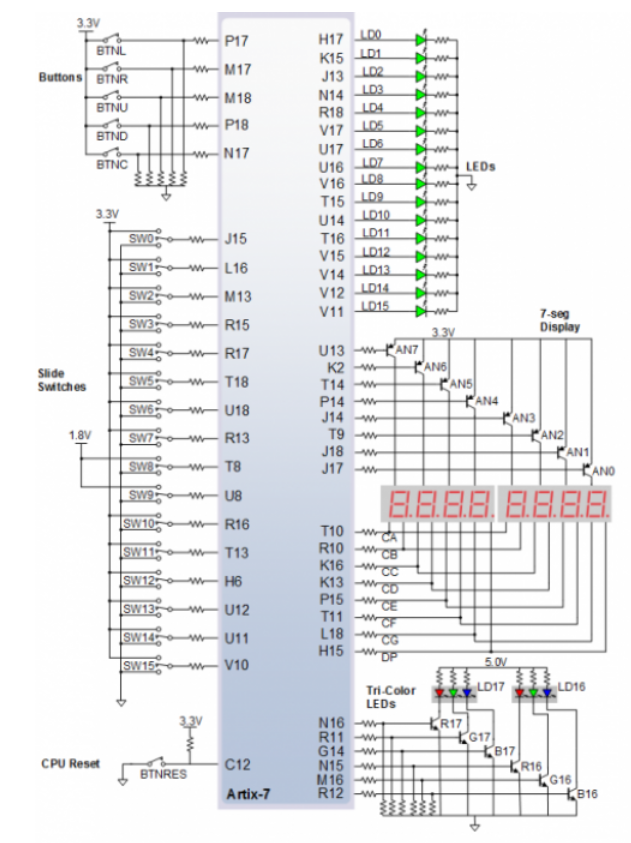
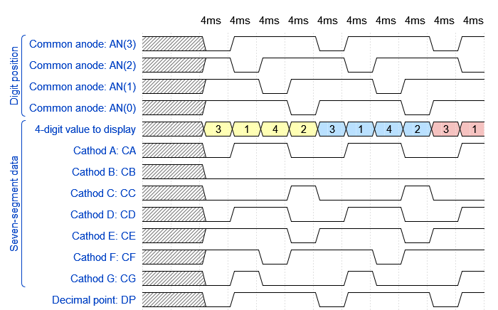

  
  
  

  > The figure above was created in [WaveDrom](https://wavedrom.com/) digital timing diagram online tool. The figure source code is as follows:
  >
  ```javascript
  {
  signal:
  [
    ['Digit position',
      {name: 'Common anode: AN(3)', wave: 'xx01..01..01'},
      {name: 'Common anode: AN(2)', wave: 'xx101..01..0'},
      {name: 'Common anode: AN(1)', wave: 'xx1.01..01..'},
      {name: 'Common anode: AN(0)', wave: 'xx1..01..01.'},
    ],
    ['Seven-segment data',
      {name: '4-digit value to display', wave: 'xx3333555599', data: ['3','1','4','2','3','1','4','2','3','1']},
      {name: 'Cathod A: CA', wave: 'xx01.0.1.0.1'},
      {name: 'Cathod B: CB', wave: 'xx0.........'},
      {name: 'Cathod C: CC', wave: 'xx0..10..10.'},
      {name: 'Cathod D: CD', wave: 'xx01.0.1.0.1'},
      {name: 'Cathod E: CE', wave: 'xx1..01..01.'},
      {name: 'Cathod F: CF', wave: 'xx1.01..01..'},
      {name: 'Cathod G: CG', wave: 'xx010..10..1'},
    ],
    {name: 'Decimal point: DP', wave: 'xx01..01..01'},
  ],
  head:
  {
    text: '                    4ms   4ms   4ms   4ms   4ms   4ms   4ms   4ms   4ms   4ms',
  },
}
  ```

<a name="part1"></a>
