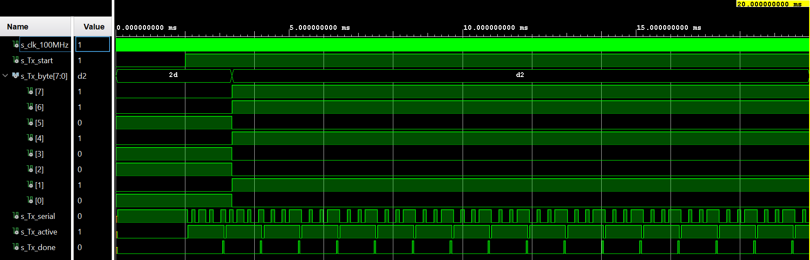
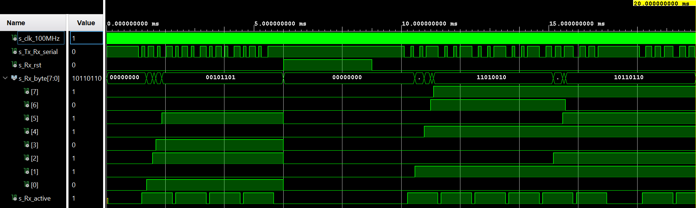
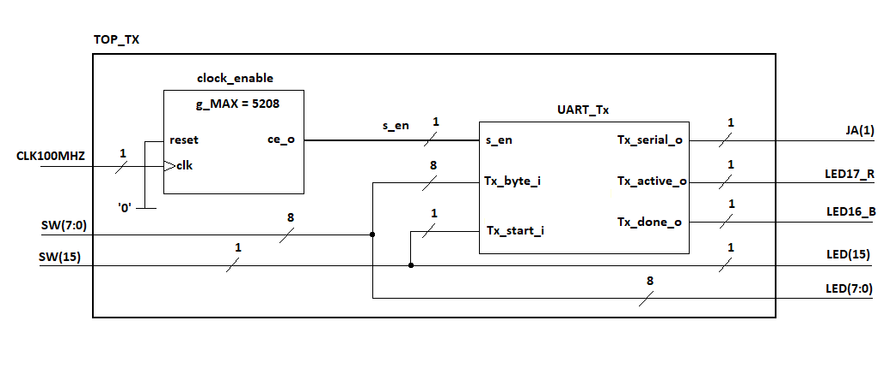
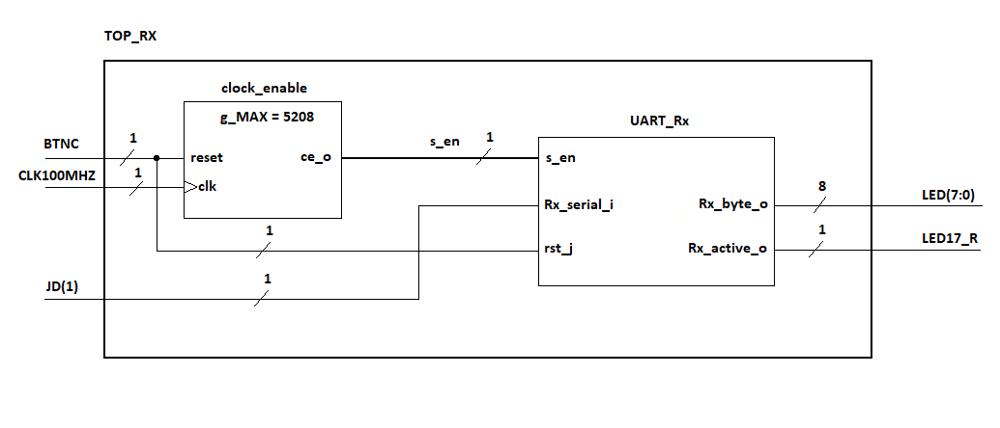
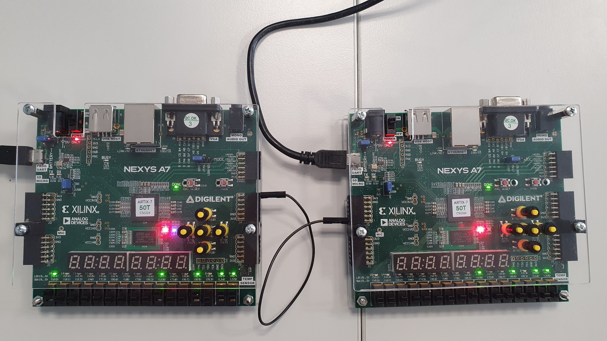
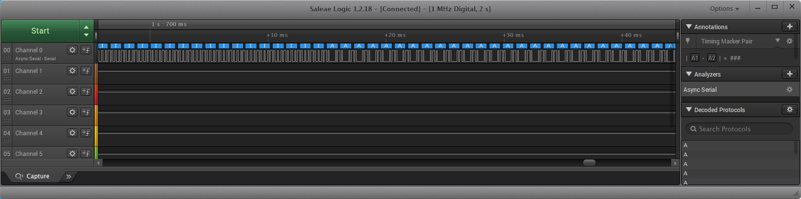

# UART Interface

### Team members

* Tomáš Kristek (responsible for programming)
* Tomáš Kašpar (responsible for simulations, documentation and videoediting)
* Dušan Kratochvíl (responsible for top and narration)

### Table of contents

* [Project objectives](#objectives)
* [Hardware description](#hardware)
* [VHDL modules description and simulations](#modules)
   * [Transmitter](#transmitter)
   * [Reciever](#reciever)
* [TOP modules description](#top)
* [Oscilogram](#oscilogram)
* [Video](#video)
* [References](#references)

<a name="objectives"></a>

## Project objectives

**Transmitter**
* Generování 8-bitové informace se start a stop bitem pomocí CLK_EN (8N1)
* Simulace v testbench
* Implementace na desku - výstup jako pin OUT z pravé strany desky
* Záznam průběhu logickou sondou


**Reciever**
* Seřazení vstupní informace od bitu s nejnižší váhou po nejvyšší v pořadí jakém přišly
* Simulace v testbench
* Generování 8 bitů sériového signálu externě z druhé desky a připojení na pin IN z levé strany desky
* Zobrazení na LED

**Top modul**
* Propojení TX a RX, jakožto dvou desek
* Finální funkce s implementací

**Videodokumentace**

<a name="hardware"></a>

## Hardware description

### UART - Universal Asynchronous Reciever-Transmitter
Počítačová sběrnice pro asynchronní sériový přenos dat. Rychlost přenosu je konfigurovatelná - v našem případě 9600 Bd (**9.6kb/s**).

Bývá realizován integrovaným obvodem (8250 UART/16550 UART) nebo taky jako součást jednočipového počítače a slouží jako sériový port (na desce Nexys A7-50T jako MicroUSB-B pro naprogramování vnitřního FPGA čipu) a jako standard můžeme uvézt například **RS-232** nebo **RS-485**.

X-bitová informace je vždy zapouzdřena v sériové sekvenci bitů se startovacím bitem. V našem případě 8 bitů sériové informace + jeden start/stop bit (**8N1**).


*8-bitový rámec 8N1 (8 Datových bitů, Bez parity, 1 Stop, 0.1ms na bit)*


*Příklad sériové komunikace UART - propojení **RS232***

<a name="modules"></a>

# VHDL modules description and simulations

<a name="transmitter"></a>
## Transmitter

**Seznam entit**

   | **Name of entity** | **Direction** | **Type** | **Popis proměnných** |
   | :-: | :-: | :-: | :-: |
   | `clk_i`       | IN    |`std_logic`                   | CLK signál                                                              |
   | `Tx_start_i`  | IN    |`std_logic`                   | Enable šifrování - start/stop tlačítko pro zahájení a ukončení přenosu  |
   | `Tx_byte_i`   | IN    |`std_logic_vector(7 downto 0)`| 8-bitová informace                                                      |
   | `Tx_serial_o` | OUT   |`std_logic := '1'`            | Samotný rámec obohacený o start/stop bit  - napevno nastavena do "1", kvůli zahájení komunikace nulou  |
   | `Tx_active_o` | OUT   |`std_logic`                   | Hlídání aktivního přenosu - přechází do nuly, pokud Idle_s <= 1         |
   | `Tx_done_o`   | OUT   | `std_logic`                  | Posílá zprávu o úspěšném přenosu celého rámce, zároveň s stop bitem     |

**Popis kódu**

```vhdl
------------------------------------------------------------
-- Architecture body for UART Transmitter
------------------------------------------------------------
architecture Behavioral of UART_Tx is

    -- Define the states
    type t_Tx is (Idle_s, Tx_start_bit_s, Tx_data_s, Tx_stop_bit_s, Tx_done_s);
    
    -- Local signals for Transmitter
    signal s_Tx      : t_Tx := Idle_s;
    signal s_en      : std_logic := '0';
    signal s_Tx_data : std_logic_vector (7 downto 0) := "00000000";
    signal s_cnt     : unsigned(0 downto 0) := b"0";
    signal s_bit     : integer range 0 to 7 := 0;
    
    -- Local constants for Transmitter
    constant c_ZERO  : unsigned := b"0";
    constant c_BIT   : unsigned := b"1";
    
begin

--------------------------------------------------------
    -- Instance (copy) of clock_enable entity generates 
    clk_en : entity work.clock_enable
        generic map(
            g_MAX => 5208
        )
        port map(
            clk   => clk_i,
            reset => '0',
            ce_o  => s_en
        );
```

Pro transmitter jsme použili námi vytvořený funkční blok **clock enable** z předchozích cvičení. Počet period jsme stanovili na **5209**, což koresponduje s trváním jednoho celého rámce (osmibitové informace + start/stop bit) přesně 1 milisekundu. V úvodu jsme dále definovali parametry šifrování:
* Signál CLK, který bude vybírat data na náběžnou hranu
* Start a stop bit
* Samotná data v rámci 8N1

```vhdl
    -- Whole process for UART Transmitter
    p_UART_Tx: process(clk_i)
    begin
        if rising_edge(clk_i) and s_en = '1' then         
            case s_Tx is
                
                when Idle_s =>
                    Tx_active_o <= '0';
                    Tx_serial_o <= '1';
                    Tx_done_o   <= '0';
                    s_cnt       <= c_ZERO;
                    s_bit       <= 0;
                    
                    if Tx_start_i = '1' then
                        s_Tx_data <= Tx_byte_i;
                        s_Tx      <= Tx_start_bit_s;
                    else
                        s_Tx      <= Idle_s;
                    end if;
            
                -- start bit = '0'
                when Tx_start_bit_s =>
                    Tx_active_o <= '1';
                    Tx_serial_o <= '0';
                        
                    if s_cnt < c_BIT then
                        s_cnt <= s_cnt + 1;
                        s_Tx  <= Tx_start_bit_s;
                    else
                        s_cnt <= c_ZERO;
                        s_Tx  <= Tx_data_s;
                    end if;
                    
                when Tx_data_s =>
                    Tx_serial_o <= s_Tx_data(s_bit);
                        
                    if s_cnt < c_BIT then
                        s_cnt <= s_cnt + 1;
                        s_Tx  <= Tx_data_s;
                    else
                        s_cnt <= c_ZERO;
                            
                        if s_bit < 7 then
                            s_bit <= s_bit + 1;
                            s_Tx  <= Tx_data_s;
                        else
                            s_bit <= 0;
                            s_Tx  <= Tx_stop_bit_s;
                        end if;                           
                    end if;
                
                -- stop bit = '1'
                when Tx_stop_bit_s =>
                    Tx_serial_o <= '1';
                        
                    if s_cnt < c_BIT then
                        s_cnt <= s_cnt + 1;
                        s_Tx  <= Tx_stop_bit_s;
                    else
                        s_cnt <= c_ZERO;
                        s_Tx  <= Tx_done_s;
                    end if;
                    
                when Tx_done_s =>
                    Tx_active_o <= '0';
                    Tx_done_o   <= '1';
                    s_Tx        <= Idle_s;
                
                when others =>
                    s_Tx <= Idle_s;
                           
            end case;
        end if;    
    end process p_UART_Tx;
--------------------------------------------------------

end Behavioral;

```

Při detekování náběžné hrany se vždy nejprve zjistí, zda uživatel zahájil přenos dat pomocí **Tx_start_i**. Jakmile pak zahájí přenos dat, nejprve se pošle start bit, 8-bit informaci a nakonec stop bit. Tato sekvence se opakuje, dokud přenos neukončí.

O přeposlání celého rámce dá vždy vědět s_Tx_done, zároveň se stop bitem.

Program je koncipován tak, že pokud Tx_start_i přepne v průběhu odesílání do 0, tak se informace neztratí a přenos skončí po jejím úplném odeslání. Další cyklus tedy nezapočne.

**Simulace**


*Funkce vysílače - Výstup s přepínaným Tx_start_i*


*Zoom na průběh jednoho rámce*

<a name="reciever"></a>
## Reciever

**Seznam entit**

   | **Name of entity** | **Direction** | **Type** | **Popis proměnných** |
   | :-: | :-: | :-: | :-: |
   | `clk_i`         | IN    |`std_logic`                     | CLK signál                                             
   | `rst_i`         | IN    |`std_logic`                     | Reset tlačítko                                         
   | `Rx_serial_i`   | IN    |`std_logic`                     | 8N1 rámec - výstup z vysílače                          |
   | `Rx_byte_o`     | OUT   |`std_logic_vector(7 downto 0)`  | Dešifrování dat z sériového vstupu na 8bit infornmaci  |
   | `Rx_active_o`   | OUT   |`std_logic`                     | Hlídání aktivního přenosu                              |


**Popis kódu**

```vhdl
------------------------------------------------------------
-- Architecture body for UART Reciever
------------------------------------------------------------
architecture Behavioral of UART_Rx is

    -- Define the states
    type t_Rx is (Idle_s, Rx_start_bit_s, Rx_data_s, Rx_stop_bit_s, Rx_done_s);
    
    -- Local signals for Reciever
    signal s_Rx      : t_Rx := Idle_s;
    signal s_en      : std_logic := '0';
    signal s_Rx_data : std_logic := '1';
    signal s_Rx_byte : std_logic_vector (7 downto 0) := b"00000000";
    signal s_cnt     : unsigned(0 downto 0) := "0";
    signal s_bit     : integer range 0 to 7 :=0;
    
    -- Local constants for Reciever
    constant c_ZERO  : unsigned := b"0";
    constant c_BIT   : unsigned := b"1";
      
begin

--------------------------------------------------------
    -- Instance (copy) of clock_enable entity generates 
    clk_en : entity work.clock_enable
        generic map(
            g_MAX => 5208
        )
        port map(
            clk   => clk_i,
            reset => rst_i,
            ce_o  => s_en
        );
```

Pro signály a port mapu platí analogicky to samé co pro vysílač. Na straně přijímače je třeba pouze sériový přenos znovu převézt do 8-bitového čísla.

```vhdl
-- Data conversion from input Rx_serial to
    -- internal signal Rx_data
    p_DATACON : process(clk_i)
    begin
        if rising_edge(clk_i) and s_en = '1' then
            s_Rx_data <= Rx_serial_i;
        end if;
    end process p_DATACON;
--------------------------------------------------------  

--------------------------------------------------------  
    -- Whole process for UART Transmitter    
    p_UART_Rx: process(clk_i)
    begin
        if rising_edge(clk_i) then
        
            if rst_i = '1' then
                Rx_active_o <= '0';
                s_cnt       <= c_ZERO;
                s_bit       <= 0;
                s_Rx_byte   <= "00000000";
                s_Rx        <= Idle_s;
            elsif s_en = '1' then
                s_Rx <= Idle_s;
                
                case s_Rx is
            
                    when Idle_s =>
                        Rx_active_o <= '0';
                        s_cnt       <= c_ZERO;
                        s_bit       <= 0;
                    
                        if s_Rx_data = '0' then
                            s_Rx        <= Rx_start_bit_s;
                            Rx_active_o <= '1';
                            s_cnt       <= s_cnt + 1;
                        else
                            s_Rx <= Idle_s;
                        end if;
            
                    -- start bit = '0'
                    when Rx_start_bit_s =>
                        if s_cnt < c_BIT then
                            s_cnt <= s_cnt + 1;
                            s_Rx  <= Rx_start_bit_s;
                        else
                            s_Rx  <= Rx_data_s;
                            s_cnt <= c_ZERO;
                        end if; 
                        
                    when Rx_data_s =>
                        if s_cnt < c_BIT then
                            s_cnt <= s_cnt + 1;
                            s_Rx  <= Rx_data_s;
                        else
                            s_cnt            <= c_ZERO;
                            s_Rx_byte(s_bit) <= s_Rx_data;
                        
                            if s_bit < 7 then
                                s_bit <= s_bit + 1;
                                s_Rx  <= Rx_data_s;
                            else
                                s_bit <= 0;
                                s_Rx  <= Rx_stop_bit_s;
                            end if;
                        end if;

                    -- stop bit = '1'
                    when Rx_stop_bit_s =>
                        if s_cnt < c_BIT then
                            s_cnt <= s_cnt + 1;
                            s_Rx  <= Rx_stop_bit_s;
                        else
                            s_cnt <= c_ZERO;
                            s_Rx  <= Rx_done_s;
                        end if;
                    
                    when Rx_done_s =>
                        Rx_active_o <= '0';
                        s_Rx        <= Idle_s;
                    
                    when others =>
                        s_Rx <= Idle_s;
                    
                end case;
            end if;
        end if;
    end process p_UART_Rx;
    Rx_byte_o <= s_Rx_byte;
--------------------------------------------------------

end Behavioral;
```

Kontrolujeme, zda na vstupu Rx_serial_i je hodnota odpovídající "0" <= **start bitu**. Pokud ano, postupně se načítají hodnoty celého rámce. První hodnota odpovídá bitu s nejnižší váhou **LSB**.

Poté kontrolujeme správný průběh celého rámce pomocí čítače nahoru do 8. Dále se kontroluje prezence stop bitu.

Po splnění těchto podmínek, seriová kombinace se přepíše do jednoho slova.

Na konci procesu čeká na další start bit a proces se opakuje. Do té doby si pamatuje předchozí stav v případě, že by došlo k přerušení přenosu.

**Simulace**


*Funkce přijímače*


## Test bench

**Popis kódu**

```vhdl
------------------------------------------------------------
-- Architecture body for testbench
------------------------------------------------------------
architecture testbench of UART_Tb is

    -- Local constants for Tx and Rx
    constant c_CLK_100MHZ_PERIOD : time := 10 ns;
    
    -- Local signals for Tx and Rx
    signal s_clk_100MHz    : std_logic;
    signal s_Tx_Rx_serial  : std_logic;

    --Local signals for Tx
    signal s_Tx_start   : std_logic;
    signal s_Tx_byte    : std_logic_vector(7 downto 0);
    signal s_Tx_active  : std_logic;
    signal s_Tx_done    : std_logic;
    
    --Local signals for Rx
    signal s_Rx_rst     : std_logic;
    signal s_Rx_byte    : std_logic_vector(7 downto 0);
    signal s_Rx_active  : std_logic;

begin
    -- Connecting testbench signals with UART Tx entity
    -- (Unit Under Test)
    uut_UART_Tx : entity work.UART_Tx
        port map(
            clk_i       => s_clk_100MHz,
            Tx_start_i  => s_Tx_start,
            Tx_byte_i   => s_Tx_byte,
            Tx_serial_o => s_Tx_Rx_serial,
            Tx_active_o => s_Tx_active,
            Tx_done_o   => s_Tx_done
        );
        
    -- Connecting testbench signals with UART Rx entity
    -- (Unit Under Test)    
    uut_UART_Rx : entity work.UART_Rx
        port map(
            clk_i       => s_clk_100MHz,
            rst_i       => s_Rx_rst,
            Rx_serial_i => s_Tx_Rx_serial,
            Rx_byte_o   => s_Rx_byte,
            Rx_active_o => s_Rx_active
        );

    --------------------------------------------------------
    -- Clock generation process
    --------------------------------------------------------
    p_clk_gen : process
    begin
        while now < 20 ms loop -- 10 msec of simulation
            s_clk_100MHz <= '0';
            wait for c_CLK_100MHZ_PERIOD / 2;
            s_clk_100MHz <= '1';
            wait for c_CLK_100MHZ_PERIOD / 2;
        end loop;
        wait;
    end process p_clk_gen;
    
    --------------------------------------------------------
    -- Data generation process for Transmitter
    --------------------------------------------------------
    p_data_gen_Tx : process
    begin
        s_Tx_byte <= b"00101101"; wait for 6 ms;
        s_Tx_byte <= b"11010010"; wait for 8 ms;
        s_Tx_byte <= b"10110110";
        wait;
    end process p_data_gen_Tx;
    
    --------------------------------------------------------
    -- Transmitter start process
    --------------------------------------------------------
    p_stimulus : process
    begin
        s_Tx_start <= '0'; wait for 1 ms;
        s_Tx_start <= '1'; wait for 4 ms;
        s_Tx_start <= '0'; wait for 5 ms;
        s_Tx_start <= '1'; wait for 6 ms;
        s_Tx_start <= '0'; wait for 2 ms;
        s_Tx_start <= '1';
        wait;
    end process p_stimulus;
    
    --------------------------------------------------------
    -- Data generation for Rx
    --------------------------------------------------------
    -- Data for Reciever are data generated by Transmitter
    -- converted to Reciever 
    -- Data are in siganl called s_Tx_Rx_serial
    
    --------------------------------------------------------
    -- Reset generation process for Reciever
    --------------------------------------------------------
    p_rst_gen : process
    begin
        s_Rx_rst <= '0'; wait for 6 ms;
        s_Rx_rst <= '1'; wait for 3 ms;
        s_Rx_rst <= '0';
        wait;
    end process p_rst_gen;
        
end architecture testbench;
```

Simulace bloků TX a RX současně

Sériová data generovaná vysílačem jsou hned v testbench převáděná zpět na sériový vstup přijímače a převáděna zpět (viz. simulace). Z tohoto důvodu se signál pro sériová data jmenuje **s_Tx_Rx_serial**.

Zbytek kódu popisuje pouze přepínání spínače pro odesílání dat, reset tlačítko přijímače a generování odesílaných dat.

<a name="top"></a>

## TOP modules description

**Transmitter - constraints**

   | **Port name** | **Direction** | **Type** | **Description** |
   | :-: | :-: | :-: | :-: |
   | `CLK100MHZ`| in    |`std_logic`                     | CLK signál                                                                |
   | `SW`       | in    |`std_logic_vector (7 downto 0)` | ENABLE přepínač přenosu                                                   |         
   | `SW15`     | in    |`std_logic`                     | Přepínače nastavující úrovně pro rámec                                    | 
   | `LED`      | out   |`std_logic_vector (7 downto 0)` | LED pro ENABLE                                                            |
   | `LED15`    | out   |`std_logic`                     | LED pro přepínače rámce                                                   |
   | `JA1`      | out   |`std_logic`                     | Výstupní port pro připojení média (vodič)                                 |
   | `LED17_R`  | out   |`std_logic`                     | LED pro hlídání aktivního přenosu dat - ČERVENÁ                           |
   | `LED16_B`  | out   |`std_logic`                     | LED oznamující odeslání kompletního rámce - MODRÁ (blikání s periodou 1ms)|
   
**Schematic**



**Reciever - constraints**

   | **Port name** | **Direction** | **Type** | **Description** |
   | :-: | :-: | :-: | :-: |
   | `CLK100MHZ`| in    |`std_logic`                     | CLK signál                                                               |
   | `BTNC`     | in    |`std_logic`                     | Středové (žluté) resetovací tlačítko                                     |                      
   | `JD1`      | in    |`std_logic`                     | Vstupní port pro připojení média (vodič)                                 | 
   | `LED`      | out   |`std_logic_vector (7 downto 0)` | LED pro zobrazení dešifrovaných dat                                      |
   | `LED17_R`  | out   |`std_logic`                     | LED pro hlídání aktivního přenosu dat - ČERVENÁ                          |

**Schematic**




*Obě implementace ve společné funkci*

<a name="video"></a>

## Simulace vysílače
<a name="oscilogram"></a>


*Nastavení a zapojení*



*Průběh simulované kombinace*


## Video

[Komentované video na YouTube](https://youtu.be/jZc6FwfYLt4) 🎞🎥📀

<a name="references"></a>

## References

1. Wikipedie 
https://en.wikipedia.org/wiki/Universal_asynchronous_receiver-transmitter
2. University of Wisconsin-Madison 
https://ece353.engr.wisc.edu/serial-interfaces/uart-basics/
3. RS232 obrázek - ok1ufc
http://ok1ufc.nagano.cz/Desktopy/RS232/RS232.htm
4. ASCII Table - Wikimedie Commons
https://commons.wikimedia.org/wiki/File:ASCII-Table-wide.svg
