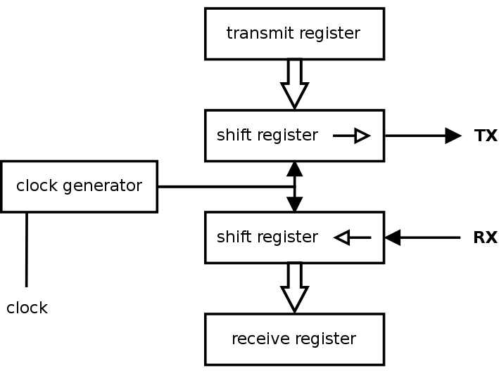
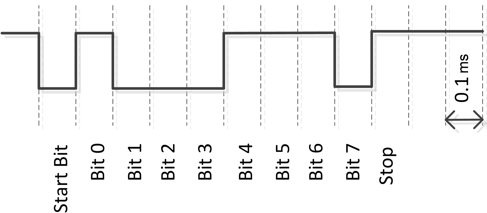
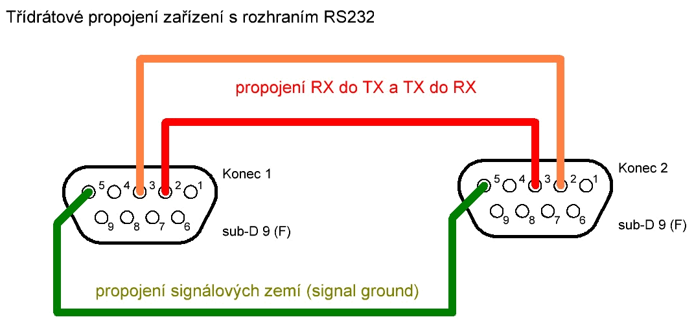
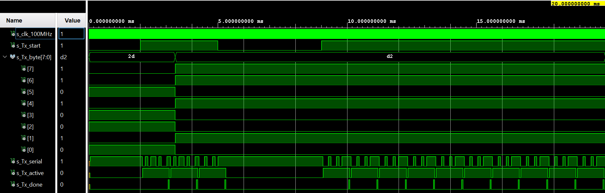
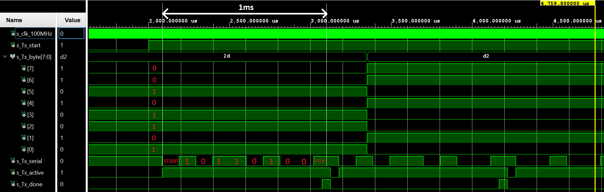

# UART Interface

### Team members

* Tomáš Kristek (responsible for programming)
* Tomáš Kašpar (responsible for simulations, documentation and editing)
* Dušan Kratochvíl (responsible for top)

### Table of contents

* [Project objectives](#objectives)
* [Hardware description](#hardware)
* [VHDL modules description and simulations](#modules)
* [VHDL modules and simulations - Transmitter](#transmitter)
* [VHDL modules and simulations - Reciever](#reciever)
* [TOP module description and simulations](#top)
* [Video](#video)
* [References](#references)

<a name="objectives"></a>

## Project objectives

**Transmitter**
* Generování 8-bitové informace s start bitem pomocí CLK_EN (8N1)
* Simulace v testbench
* Implementace na desku - výstup jako pin OUT z pravé strany desky
* Záznam průběhu na osciloskopu


**Reciever**
* Seřazení vstupní informace od bitu s nejnižší váhou po nejvyšší v pořadí jakém přišly
* Simulace v testbench
* Generování 8 bitů sériového signálu externě a připojení na pin IN z pravé strany desky)
* Zobrazení na 7 seg displeji

**Top modul**
* Propojení TX a RX, jakožto dvou desek
* Finální funkce s implementací

<a name="hardware"></a>

## Hardware description

### UART - Universal Asynchronous Reciever-Transmitter
Počítačová sběrnice pro asynchronní sériový přenos dat. Rychlost přenosu je konfigurovatelná - v našem případě 9600 Bd (**9.6kb/s**).

Bývá realizován integrovaným obvodem (8250 UART/16550 UART) nebo taky jako součást jednočipového počítače a slouží jako sériový port (na desce Nexys A7-50T jako MicroUSB-B pro naprogramování vnitřního FPGA čipu) a jako standard můžeme uvézt například **RS-232** nebo **RS-485**.

X-bitová informace je vždy zapouzdřena v sériové sekvenci bitů se startovacím bitem. V našem případě 8 bitů sériové informace + jeden start/stop bit (**8N1**).

<a name="modules"></a>



*8-bitový rámec 8N1 (8 Datových bitů, Bez parity, 1 Stop, 0.1ms na bit)*







*Příklad sériové komunikace UART - propojení **RS232***

# VHDL modules description and simulations

<a name="transmitter"></a>
## Transmitter

**Seznam entit**

   | **Name of entity** | **IN/OUT** | **Logika** | **Popis** |
   | :-: | :-: | :-: | :-: |
   | clk_i       | 200 000    | `x"3_0d40"`    | `b"0011_0000_1101_0100_0000"`           |
   | Tx_start_i  | 400 000    |`x"6_1A80"`     | `b"0110_0001_1010_1000_0000"`           |
   | Tx_byte_i   | 1 000 000  |`x"F_4240"`     | `b"1111_0100_0010 0100_0000"`           |
   | Tx_serial_o | 25 000 000 |`x"17D_7840"`   | `b"0001_0111_1101_0111_1000_0100_0000"` |
   | Tx_active_o | 50 000 000 |`x"2FA_F080"`   | `b"0010_1111_1010_1111_0000_1000_0000"` |
   | Tx_done_o   | 100 000 000 | `x"5F5_E100"`  | `b"0101_1111_0101_1110_0001_0000_0000"` |

**Popis kódu**

```vhdl
------------------------------------------------------------
-- Architecture body for UART Transmitter
------------------------------------------------------------
architecture Behavioral of UART_Tx is

    -- Define the states
    type t_Tx is (Idle_s, Tx_start_bit_s, Tx_data_s, Tx_stop_bit_s, Tx_done_s);
    
    -- Local signals for Transmitter
    signal s_Tx      : t_Tx := Idle_s;
    signal s_en      : std_logic := '0';
    signal s_Tx_data : std_logic_vector (7 downto 0) := "00000000";
    signal s_cnt     : unsigned(0 downto 0) := b"0";
    signal s_bit     : integer range 0 to 7 := 0;
    
    -- Local constants for Transmitter
    constant c_ZERO  : unsigned := b"0";
    constant c_BIT   : unsigned := b"1";
    
begin

--------------------------------------------------------
    -- Instance (copy) of clock_enable entity generates 
    clk_en : entity work.clock_enable
        generic map(
            g_MAX => 5208
        )
        port map(
            clk   => clk_i,
            reset => '0',
            ce_o  => s_en
        );
```

Pro transmitter jsme použili námi vytvořený funkční blok **clock enable** z předchozích cvičení. Počet period jsme stanovili na **5209**, což koresponduje s trváním jednoho celého rámce (osmibitové informace + start/stop bit) přesně 1 milisekundu. V úvodu jsme dále definovali parametry šifrování:
* Signál CLK, který bude vybírat data na náběžnou hranu
* Start a stop bit
* Samotná data v rámci 8N1

```vhdl
    -- Whole process for UART Transmitter
    p_UART_Tx: process(clk_i)
    begin
        if rising_edge(clk_i) and s_en = '1' then         
            case s_Tx is
                
                when Idle_s =>
                    Tx_active_o <= '0';
                    Tx_serial_o <= '1';
                    Tx_done_o   <= '0';
                    s_cnt       <= c_ZERO;
                    s_bit       <= 0;
                    
                    if Tx_start_i = '1' then
                        s_Tx_data <= Tx_byte_i;
                        s_Tx      <= Tx_start_bit_s;
                    else
                        s_Tx      <= Idle_s;
                    end if;
            
                -- start bit = '0'
                when Tx_start_bit_s =>
                    Tx_active_o <= '1';
                    Tx_serial_o <= '0';
                        
                    if s_cnt < c_BIT then
                        s_cnt <= s_cnt + 1;
                        s_Tx  <= Tx_start_bit_s;
                    else
                        s_cnt <= c_ZERO;
                        s_Tx  <= Tx_data_s;
                    end if;
                    
                when Tx_data_s =>
                    Tx_serial_o <= s_Tx_data(s_bit);
                        
                    if s_cnt < c_BIT then
                        s_cnt <= s_cnt + 1;
                        s_Tx  <= Tx_data_s;
                    else
                        s_cnt <= c_ZERO;
                            
                        if s_bit < 7 then
                            s_bit <= s_bit + 1;
                            s_Tx  <= Tx_data_s;
                        else
                            s_bit <= 0;
                            s_Tx  <= Tx_stop_bit_s;
                        end if;                           
                    end if;
                
                -- stop bit = '1'
                when Tx_stop_bit_s =>
                    Tx_serial_o <= '1';
                        
                    if s_cnt < c_BIT then
                        s_cnt <= s_cnt + 1;
                        s_Tx  <= Tx_stop_bit_s;
                    else
                        s_cnt <= c_ZERO;
                        s_Tx  <= Tx_done_s;
                    end if;
                    
                when Tx_done_s =>
                    Tx_active_o <= '0';
                    Tx_done_o   <= '1';
                    s_Tx        <= Idle_s;
                
                when others =>
                    s_Tx <= Idle_s;
                           
            end case;
        end if;    
    end process p_UART_Tx;
--------------------------------------------------------

end Behavioral;

```

Při detekování náběžné hrany se vždy nejprve zjistí, zda uživatel zahájil přenos dat pomocí **Tx_start_i**. Jakmile pak zahájí přenos dat, nejprve se pošle start bit, 8-bit informaci a nakonec stop bit. Tato sekvence se opakuje, dokud přenos neukončí.

O přeposlání celého rámce dá vždy vědět s_Tx_done, zároveň se stop bitem.

Program je koncipován tak, že pokud Tx_start_i přepne v průběhu odesílání do 0, tak se informace neztratí a přenos skončí po jejím úplném odeslání. Další cyklus tedy nezapočne.

**Simulace**


*Výstup s přepínaným Tx_start_i*


*Zoom na průběh jednoho rámce*

<a name="reciever"></a>
## Reciever

**Popis kódu**

## Test bench

**Popis kódu**

<a name="top"></a>

## TOP module description and simulations

Write your text here.

<a name="video"></a>

## Video

Write your text here

<a name="references"></a>

## References

1. Wikipedie 
https://en.wikipedia.org/wiki/Universal_asynchronous_receiver-transmitter
2. University of Wisconsin-Madison 
https://ece353.engr.wisc.edu/serial-interfaces/uart-basics/
3. RS232 obrázek - ok1ufc
http://ok1ufc.nagano.cz/Desktopy/RS232/RS232.htm
