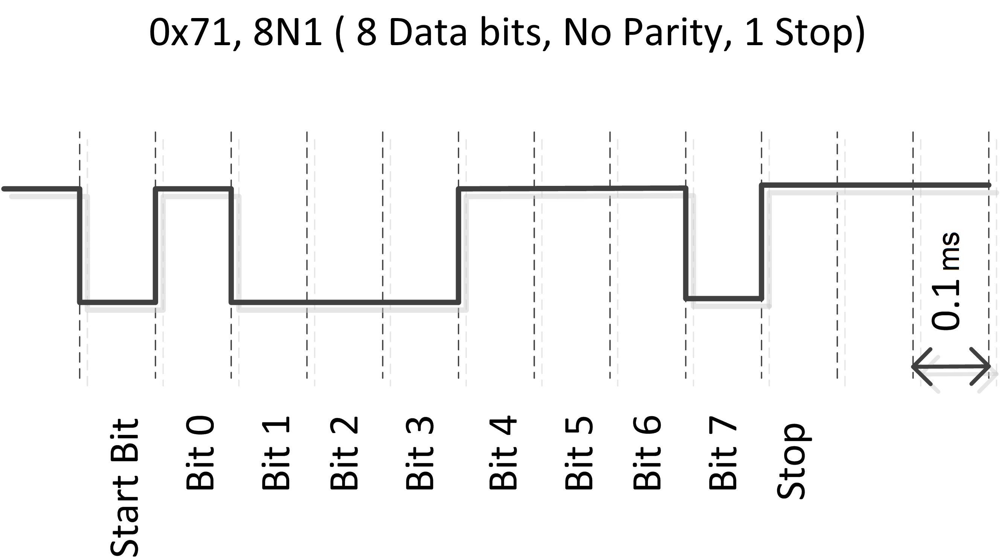

# UART Interface

### Team members

* Tomáš Kristek (responsible for xxx)
* Tomáš Kašpar (responsible for xxx)
* Dušan Kratochvíl (responsible for xxx)

### Table of contents

* [Project objectives](#objectives)
* [Hardware description](#hardware)
* [VHDL modules description and simulations](#modules)
* [TOP module description and simulations](#top)
* [Video](#video)
* [References](#references)

## Project objectives

Transmitter
* Generování 8-bitové informace s start bitem pomocí CLK_EN (8N1)

Reciever
* Seřazení vstupní informace od bitu s nejnižší váhou po nejvyšší v pořadí jakém přišly

## Hardware description

### UART - Universal Asynchronous Reciever-Transmitter
Počítačová sběrnice pro asynchronní sériový přenos dat. Rychlost přenosu je konfigurovatelná - v našem případě 9600 Bd (**9.6kb/s**).

Bývá realizován integrovaným obvodem (8250 UART/16550 UART) nebo taky jako součást jednočipového počítače a slouží jako sériový port (na desce Nexys A7-50T jako MicroUSB-B pro naprogramování vnitřního FPGA čipu) a jako standard můžeme uvézt například **RS-232** nebo **RS-485**.

X-bitová informace je vždy zapouzdřena v sériové sekvenci bitů se startovacím bitem. V našem případě 8 bitů sériové informace + jeden start/stop bit (**8N1**).

8-bitový rámec 8N1

## VHDL modules description and simulations

Write your text here.

## TOP module description and simulations

Write your text here.

## Video

Write your text here

## References

1. Wikipedie https://en.wikipedia.org/wiki/Universal_asynchronous_receiver-transmitter
